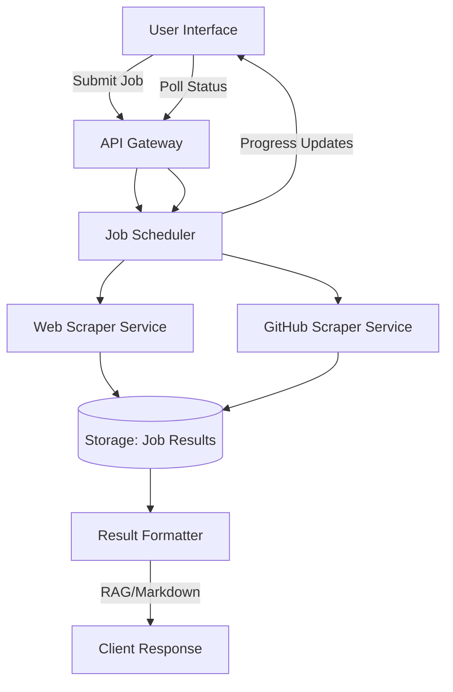

# System Architecture

## Components
1. **User Interface**: Flutter web application with responsive layout
2. **API Gateway**: Handles all client requests and routes to appropriate services
3. **Job Scheduler**: Manages queueing, prioritization, and distribution of scraping jobs
4. **Scraper Services**: 
   - Web Scraper: Processes website URLs with configurable depth/max pages
   - GitHub Scraper: Handles repository cloning and documentation extraction
5. **Storage**: Persistent storage for job metadata and results
6. **Result Formatter**: Converts raw scraped data into RAG or markdown formats